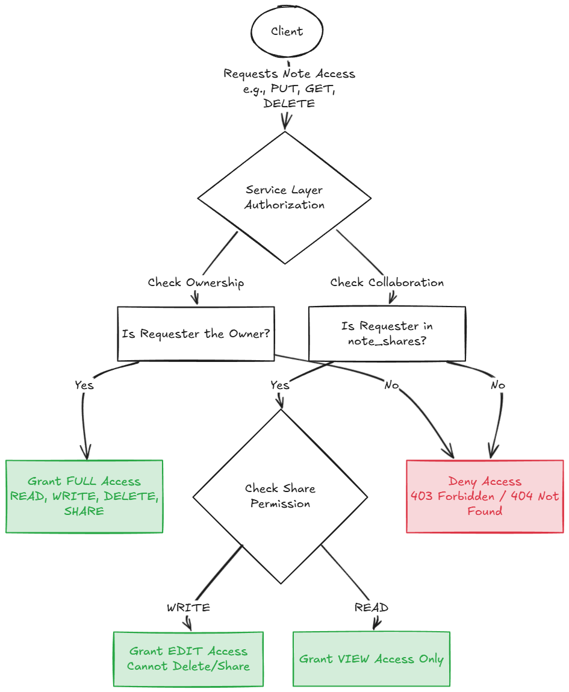
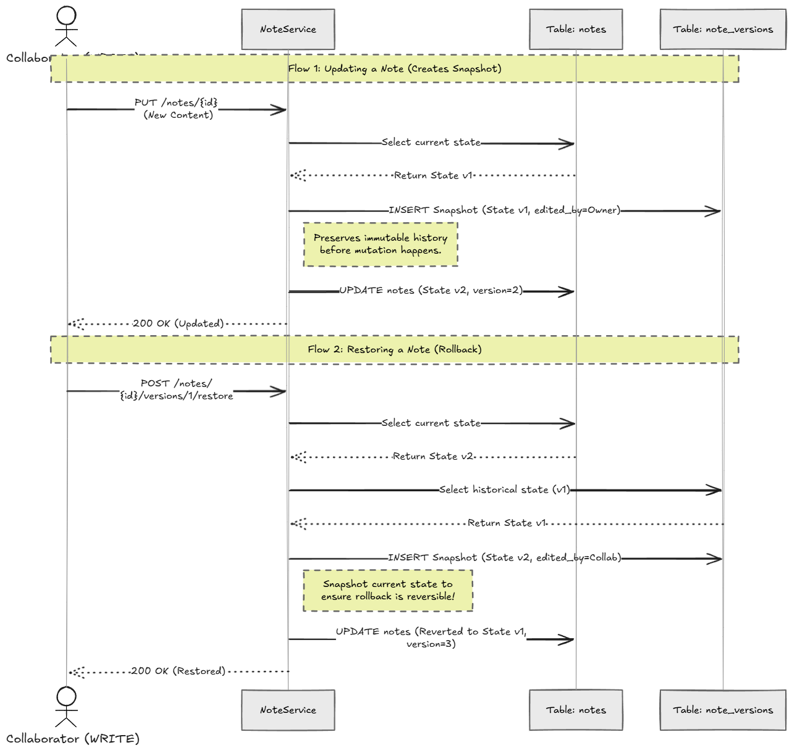

# Smart Features 


# Smart Feature 1 — Collaborative Sharing with Permission-Based Authorization

## Pictorial Representation




## Feature Description

The Notes backend implements a collaboration system where notes can be shared with other registered users using email-based sharing. Each shared collaborator is assigned a granular permission level (`READ` or `WRITE`) stored in the `note_shares` join table using a composite primary key (`note_id`, `shared_with_user_id`).

The authorization model is enforced entirely at the service/repository layer rather than at controller level, ensuring centralized and secure access control.

The final implementation supports:

| Capability                   | Description                                           |
| ---------------------------- | ----------------------------------------------------- |
| READ permission              | Collaborator can view/search note                     |
| WRITE permission             | Collaborator can edit/update note                     |
| Owner-only delete            | Only owner can delete notes                           |
| Owner-only re-share          | Only owner can share/revoke                           |
| Email-based collaboration    | Users are shared by email                             |
| Secure authorization queries | Repository-level access checks using `EXISTS` queries |
| Shared note retrieval        | Shared notes accessible through search/access APIs    |
| Optimistic locking support   | Concurrent updates protected using `@Version`         |

## Important Engineering Improvements Added During Development

---

### 1. Permission-Aware Editable Access

Separate repository queries were implemented for:

* accessible notes
* editable notes

This ensures:

* READ users cannot mutate
* WRITE users can edit
* owners retain destructive control

---

### 2. Product-Level Collaboration Semantics

The feature now behaves similarly to real collaborative systems such as:

* Google Docs
* Notion
* Google Keep

rather than being a simple “share boolean” implementation.

---

# Smart Feature 2 — Immutable Version History with Restore Capability

## Pictorial Representation



## Feature Description

The Notes backend implements a version-controlled edit history system for collaborative recovery and auditability.

Before every successful note update:

1. the current state of the note is snapshotted into `note_versions`
2. metadata about the editor and edit timestamp is stored
3. a monotonically increasing `version_number` is assigned

The system exposes:

* paginated version history retrieval
* specific version retrieval
* version restoration (rollback)

This creates an immutable historical audit trail for collaborative editing workflows.

---

## Feature Capabilities

| Capability                | Description                              |
| ------------------------- | ---------------------------------------- |
| Automatic snapshots       | Previous state captured before edits     |
| Immutable history         | Historical versions never mutated        |
| Version numbering         | Sequential per-note version ordering     |
| Restore endpoint          | Rollback to historical state             |
| Editor attribution        | Tracks who edited                        |
| Paginated retrieval       | Efficient large-history access           |
| Access-controlled history | Only authorized collaborators can view   |
| Bounded retention         | Old versions automatically pruned        |
| Restore-safe snapshotting | Current state snapshotted before restore |

---

## Important Engineering Improvements Added During Development

### 1. Retention/Pruning Logic

Ascending-order pruning to preserve latest versions.

---

### 2. Restore Workflow

The system is an actionable recovery system via:

```http
POST /notes/{noteId}/versions/{versionId}/restore
```

Restore flow:

1. validate WRITE access
2. snapshot current state
3. restore selected historical version
4. save restored note
5. preserve rollback audit trail

---

### 3. Added Version Numbers

UUID-only versions were insufficient for chronological reasoning.

A dedicated `version_number` field was added for:

* deterministic ordering
* UI clarity
* human-readable history

---

### 4. Bounded Storage Optimization

Version history retention is automatically limited (e.g., latest 50 retained) to avoid unbounded storage growth.

This balances:

* auditability
* database growth
* long-term storage efficiency

---
