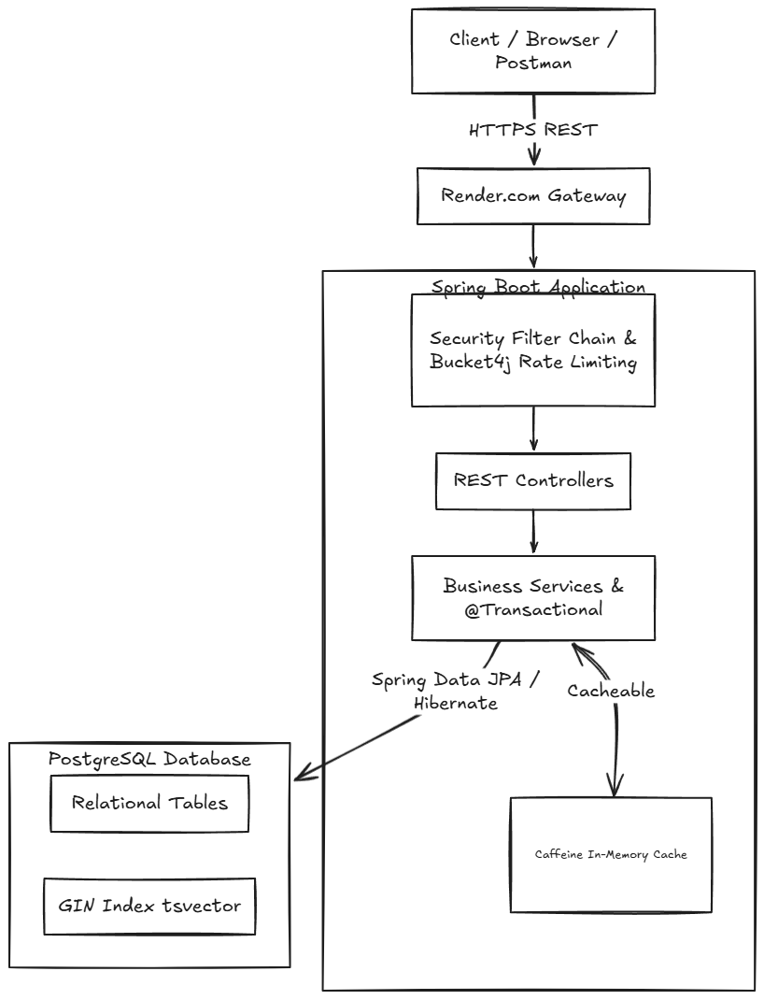
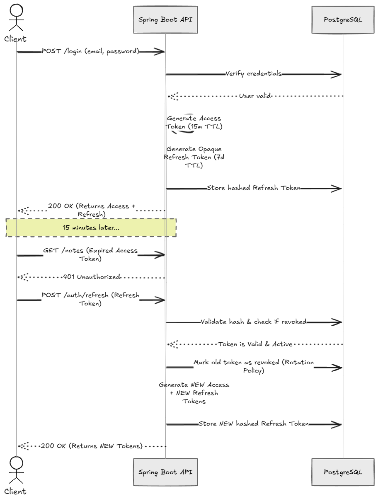

# SYSTEM DESIGN

# HLD

# Auth FLow

# FRs & NFRs

---

# Functional Requirements (FRs)

## Core Functional Requirements

1. User Registration and Authentication
2. JWT-based Login and Refresh Token Rotation
3. CRUD Operations for Notes
4. Paginated and Sortable Note Retrieval
5. Soft Deletion of Notes
6. Email-Based Note Sharing
7. Permission-Based Collaboration (`READ` / `WRITE`)
8. Full-Text Search using PostgreSQL `tsvector`
9. Note Version History Retrieval
10. Historical Version Restoration
11. OpenAPI Documentation Exposure
12. Structured RFC7807 Error Responses
13. Rate-Limited Authentication APIs
14. Health Monitoring Endpoint

---

#  Non-Functional Requirements (NFRs)

## 1. Security

* Stateless JWT authentication using access + refresh token architecture
* Refresh token rotation with reuse detection
* BCrypt password hashing with strength factor 12
* Bucket4j rate limiting to mitigate brute-force attacks
* Centralized authorization checks at service/repository layer
* Parameterized JPA/native queries to prevent SQL injection
* Owner-aware and permission-aware resource authorization
* Role-separated collaboration semantics (`READ` vs `WRITE`)

---

## 2. Performance & Latency

* PostgreSQL GIN indexing on `tsvector` column for optimized full-text search
* Weighted search ranking using `ts_rank_cd`
* B-Tree indexing on foreign keys and pagination columns
* In-memory Caffeine caching for frequent read operations
* Pagination and capped page sizes to prevent heavy payloads
* `@EntityGraph` optimization to reduce N+1 query problems
* Short-lived cache eviction strategy for freshness-performance balance

---

## 3. Reliability & Concurrency

* Optimistic locking using Hibernate `@Version`
* Conflict-safe collaborative updates
* Immutable version snapshots before mutations
* Soft-delete semantics to avoid accidental hard data loss
* Automatic bounded version retention for storage stability
* Transactional service-layer operations using `@Transactional`

---

## 4. Maintainability & Architecture

* SOLID-oriented layered architecture
* Clear separation between:

  * Controllers
  * Services
  * Repositories
  * DTOs
  * Security
* MapStruct-based DTO/entity mapping
* Flyway versioned migrations for schema evolution
* Constructor-based dependency injection
* Environment-driven configuration (`12-factor app` principles)

---

## 5. API Design & Developer Experience

* RFC 7807 compliant structured error responses
* OpenAPI 3.1 specification generation via springdoc
* Swagger UI integration
* Consistent REST endpoint semantics
* UTC ISO-8601 timestamp standardization
* Validation-driven request handling using Jakarta Validation

